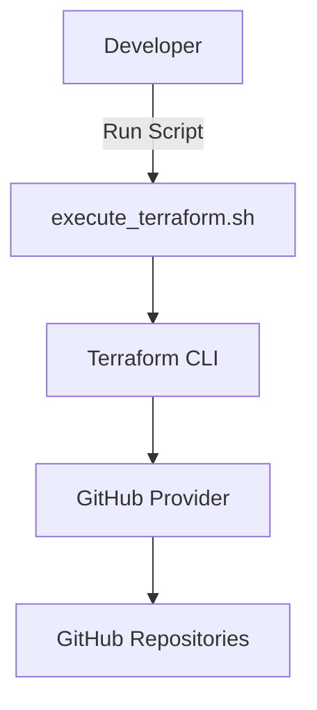

# 🚀 soltania-devops-tf-github-prototype

This project automates the creation and management of GitHub repositories using Terraform,  
with a fully automated workflow powered by a Bash script.

---

## 🔥 Features
- Provision multiple GitHub repositories with custom descriptions and visibility.
- Automate `terraform plan` and `terraform apply` with timestamped plan files.
- Archive Terraform plan files in an `old/` directory for traceability.
- Clear separation of concerns: Bash automation + Terraform infrastructure as code.

---

## 📂 Project Structure
```
.
├── src
│   └── main
│       ├── bash
│       │   └── execute_terraform.sh
│       └── terraform
│           ├── main.tf
│           ├── output.tf
│           ├── provider.tf
│           └── variable.tf
```

---

## ⚙️ Prerequisites
- [Terraform](https://developer.hashicorp.com/terraform/downloads) >= 1.5
- [Bash](https://www.gnu.org/software/bash/) >= 4.0
- A **GitHub Personal Access Token (PAT)** with the following permissions:
  - `repo`
  - `admin:repo_hook`

---

## 🔑 Setting Up GITHUB_TOKEN

### 1. Generate a GitHub Personal Access Token
1. Go to [GitHub → Settings → Developer settings → Personal access tokens](https://github.com/settings/tokens).
2. Click **"Generate new token (classic)"**.
3. Select:
   - `repo` (Full control of private repositories)
   - `admin:repo_hook` (Full control of repository hooks)
4. Set an expiration date for security.
5. Copy the token.

---

### 2. Export the Token as an Environment Variable
Run the following commands in your terminal:
```bash
export GITHUB_TOKEN="your_personal_access_token"
export GITHUB_OWNER="your_github_user_or_org"
```

To make it persistent, add the lines to your shell profile:
```bash
echo 'export GITHUB_TOKEN="your_personal_access_token"' >> ~/.bashrc
echo 'export GITHUB_OWNER="your_github_user_or_org"' >> ~/.bashrc
source ~/.bashrc
```

---

### 3. Verify the Token
To confirm the token is correctly set:
```bash
echo $GITHUB_TOKEN
```
You should see your token (or at least part of it) printed.

---

## 🚀 Getting Started

Clone the repository:
```bash
git clone https://github.com/your_username/soltania-devops-tf-github-prototype.git
cd soltania-devops-tf-github-prototype/src/main/bash
```

Make the script executable and run it:
```bash
chmod +x execute_terraform.sh
./execute_terraform.sh
```

Terraform will:
1. Format the code
2. Initialize providers
3. Generate a timestamped plan file
4. Apply the plan automatically
5. Archive the plan file

---

## 🛠️ Customization

Edit `variable.tf` to define your repositories:
```hcl
variable "repositories" {
  default = {
    "demo_repo" = {
      description = "Demo repository created with Terraform"
      visibility  = "public"
    }
  }
}
```

---

## 🧩 Architecture Diagram


---

## 🔒 Security Best Practices
- Never commit your `GITHUB_TOKEN`.
- Add `.terraform/`, `*.tfstate`, and `*.tfplan` to `.gitignore`.
- Use Terraform Cloud or a secure backend for production environments.

---

## 🏷️ Badges


---

## 📜 License
This project is licensed under the [MIT License](LICENSE).

---

## 💡 Future Enhancements
- Add GitHub Actions CI for `terraform fmt` and `terraform validate`
- Support multiple GitHub organizations
- Include examples for advanced configurations
