# 🚀 Soltania DevOps: GitHub Infrastructure as Code

**Standardizing GitHub Repository Management via Terraform & Automation Wrappers.**

This project serves as a **Proof of Concept (PoC)** and a **Template** for managing GitHub organizations via Infrastructure as Code (IaC). It abstracts the complexity of Terraform CLI commands through robust Bash wrappers, ensuring a consistent, secure, and streamlined workflow for DevOps engineers.

-----

## 🏛️ Architecture & Workflow

This project implements a **GitOps-adjacent workflow**. Changes are defined in code, validated via local scripts, and applied to the GitHub API.

```mermaid
flowchart TD
    subgraph "Local Developer Environment"
        Dev[👱 Architect / DevOps]
        
        subgraph "Automation Layer (Scripts)"
            Wrapper[⚙️ tf_wrapper.sh]
            Publisher[🚀 publish.sh]
        end
        
        TF[🏗️ Terraform Core]
    end

    subgraph "Remote Infrastructure"
        GitHubAPI[☁️ GitHub API]
        Repo[📦 Target Repositories]
        GitRemote[🗄️ This Git Repo]
    end

    Dev -->|1. Define Infra| Wrapper
    Wrapper -->|fmt / plan / apply| TF
    TF -->|Provision| GitHubAPI
    GitHubAPI -->|Create/Update| Repo
    
    Dev -->|2. Save Code| Publisher
    Publisher -->|fmt / commit / push| GitRemote
```



-----

## 🔥 Key Features

  * **Infrastructure as Code (IaC):** Declarative management of repositories (visibility, description, topics).
  * **Unified Wrapper (`tf_wrapper.sh`):** A robust interface for Terraform lifecycle (Init, Plan, Apply, Destroy) with error handling and colorized logs.
  * **Quality Gate (`publish.sh`):** Enforces `terraform fmt` before any commit/push to maintain code standards.
  * **Security First:** Ephemeral plan files (auto-deleted after apply) to prevent sensitive data leaks.
  * **Modular Design:** Separates the automation logic (`scripts/`) from the infrastructure definition (`src/main/terraform`).

-----

## 📂 Project Structure

We follow a clean separation of concerns between **Tooling** and **Source Code**.

```text
.
├── scripts/
│   ├── tf_wrapper.sh      # The heavy-lifter: Manages Terraform lifecycle
│   └── publish.sh         # The gatekeeper: Formats and pushes code
├── src/
│   └── main/
│       └── terraform/     # The IaC definitions
│           ├── main.tf
│           ├── output.tf
│           ├── provider.tf
│           └── variable.tf
├── .gitignore
└── README.md
```

-----

## ⚙️ Prerequisites

  * [Terraform](https://developer.hashicorp.com/terraform/downloads) \>= 1.5
  * [Bash](https://www.gnu.org/software/bash/) \>= 4.0
  * **GitHub Personal Access Token (PAT)** (Classic)

-----

## 🔑 Setup & Configuration

### 1\. Configure Credentials

To interact with the GitHub API, you must export your PAT as an environment variable.

```bash
# Add to your ~/.bashrc or ~/.zshrc
export GITHUB_TOKEN="ghp_your_secure_token_here"
export GITHUB_OWNER="your_github_username_or_org"
```

> **Security Note:** Never hardcode these values in `provider.tf`. This project relies on the GitHub Provider automatically reading `GITHUB_TOKEN` from the environment.

### 2\. Clone & Prepare

```bash
git clone https://github.com/your_username/soltania-devops-tf-github-prototype.git
cd soltania-devops-tf-github-prototype

# Make scripts executable
chmod +x scripts/*.sh
```

-----

## 🚀 Usage Guide

### 1\. Managing Infrastructure (`tf_wrapper.sh`)

Use the wrapper to manage the lifecycle of your repositories.

| Command | Description |
| :--- | :--- |
| `./scripts/tf_wrapper.sh plan` | **Safe Mode.** Formats code, inits (if needed), and shows what *will* change. |
| `./scripts/tf_wrapper.sh apply` | **Action Mode.** Applies the changes to GitHub. Auto-detects if a plan exists. |
| `./scripts/tf_wrapper.sh destroy` | **Cleanup Mode.** Removes all resources managed by this project. |
| `./scripts/tf_wrapper.sh fmt` | **Maintenance.** Recursively formats Terraform files. |

**Example:**

```bash
# Preview changes
./scripts/tf_wrapper.sh plan

# Apply changes
./scripts/tf_wrapper.sh apply
```

### 2\. Development Workflow (`publish.sh`)

When you are ready to save your work to this repository, **do not use standard git commands**. Use the publisher script to ensure quality.

```bash
./scripts/publish.sh
```

  * ✅ Automatically runs `terraform fmt`.
  * ✅ Checks if there are changes.
  * ✅ Prompts for a commit message.
  * ✅ Pushes to the current branch.

-----

## 🛠️ Customization

To add or modify repositories, edit **`src/main/terraform/variable.tf`**. We use a **Map** structure to allow scalable definitions.

```hcl
variable "repositories" {
  description = "Map of repositories to provision"
  type = map(object({
    description = string
    visibility  = string
  }))

  default = {
    # Add your new repo here
    "soltania-microservice-demo" = {
      description = "A demo microservice for the portfolio"
      visibility  = "public"
    },
    "internal-tooling" = {
      description = "Private scripts for DevOps team"
      visibility  = "private"
    }
  }
}
```

-----

## 💡 Roadmap & Future Enhancements

As part of the **Slim Soltani Technical Portfolio**, this project evolves constantly.

  * [ ] **Migration to OpenTofu:** Validate the drop-in replacement capability of OpenTofu.
  * [ ] **CI/CD Integration:** Move the `tf_wrapper` logic into a GitHub Actions Pipeline.
  * [ ] **Branch Protection:** Automate branch protection rules (requires GitHub Pro/Team for private repos).
  * [ ] **Drift Detection:** Scheduled jobs to detect manual changes in the console.

-----

## 📜 License

This project is licensed under the [MIT License](https://www.google.com/search?q=LICENSE).