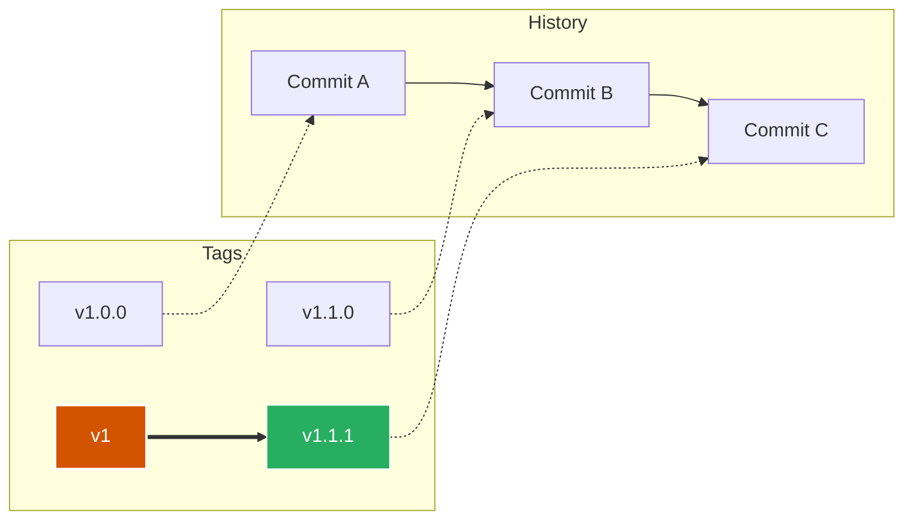

# Versioning Strategy & Stability Policy

This repository serves as a critical infrastructure dependency for downstream projects. To ensure stability and predictability, we adhere to a strict versioning and consumption policy.

## 🏷️ Semantic Versioning

We follow [Semantic Versioning 2.0.0](https://semver.org/). In the context of GitHub Actions, we define the version increments as follows:

| Version | Type | Triggers | Example |
| :--- | :--- | :--- | :--- |
| **MAJOR** | 💥 Breaking | Renaming/removing inputs, changing required secrets, removing a workflow. | `v1.0.0` → `v2.0.0` |
| **MINOR** | ✨ Feature | Adding new optional inputs, adding new templates, non-breaking logic changes. | `v1.0.0` → `v1.1.0` |
| **PATCH** | 🐛 Fix | Bug fixes, internal optimizations, documentation updates. | `v1.0.0` → `v1.0.1` |

---

## 📌 Consumption Strategies (Best Practices)

As a consumer of these workflows, you must choose a pinning strategy that balances **Stability** vs. **Freshness**.

### 1. The "Floating Major" Tag (Recommended)
We maintain a "floating" tag for the major version (e.g., `v1`). This tag is automatically updated to point to the latest non-breaking release.

```yaml
# ✅ Receives features (v1.1) and fixes (v1.0.1) automatically.
# 🛡️ Protected against breaking changes (v2.0).
uses: soltani-a/soltania-devops-templates/.github/workflows/nodejs-ci.yml@v1
````

### 2\. Specific Tag Pinning (High Stability)

For regulated environments or critical paths, pin to a specific patch version. You will not receive updates automatically.

```yaml
# ✅ 100% Predictable.
# ⚠️ Requires manual updates via Pull Request (e.g., Dependabot).
uses: soltani-a/soltania-devops-templates/.github/workflows/nodejs-ci.yml@v1.2.0
```

### 3\. SHA Pinning (Maximum Security)

To mitigate the risk of tag mutability (supply chain attacks), pin to the commit SHA.

```yaml
# ✅ Immutable. Even if the repo is compromised, this code cannot change.
# ⚠️ High maintenance.
uses: soltani-a/soltania-devops-templates/.github/workflows/nodejs-ci.yml@a1b2c3d4...
```

> **❌ Anti-Pattern:** Avoid using `@main` in production workflows. It is unstable and may contain breaking changes or untested code.

-----

## 🔄 Release Lifecycle

Our release process is automated to ensure tag consistency.



1.  **Draft:** Changes land in `main`.
2.  **Release:** A new semantic tag (e.g., `v1.1.1`) is created via **Release Drafter**.
3.  **Sync:** The major tag (`v1`) is automatically moved to point to the new `v1.1.1`.

-----

## ⏳ Deprecation Policy

When a new Major version (e.g., `v2`) is released:

1.  **Announcement:** A deprecation notice will be added to the `README.md` and `CHANGELOG.md`.
2.  **Support Window:** The previous Major version (e.g., `v1`) will receive critical security patches for **6 months**.
3.  **End of Life:** After 6 months, the old version is no longer supported.

-----

## 🛡️ Security

If you discover a security vulnerability in a workflow, please **do not open a public issue**.
Email the maintainer directly at [INSERT CONTACT] or use GitHub's "Report a Vulnerability" feature.

```

---

### Why this adds value to your profile

1.  **"The Floating Major" Concept:** Many developers don't know that `v1` can move. Explaining this shows deep knowledge of GitHub Actions mechanics.
2.  **Risk Management:** You provide options (SHA vs Tag) depending on the user's risk appetite. This is exactly what an Architect does: **Trade-off Analysis**.
3.  **Deprecation Policy:** It shows you think long-term about the lifecycle of the software, not just the initial build.